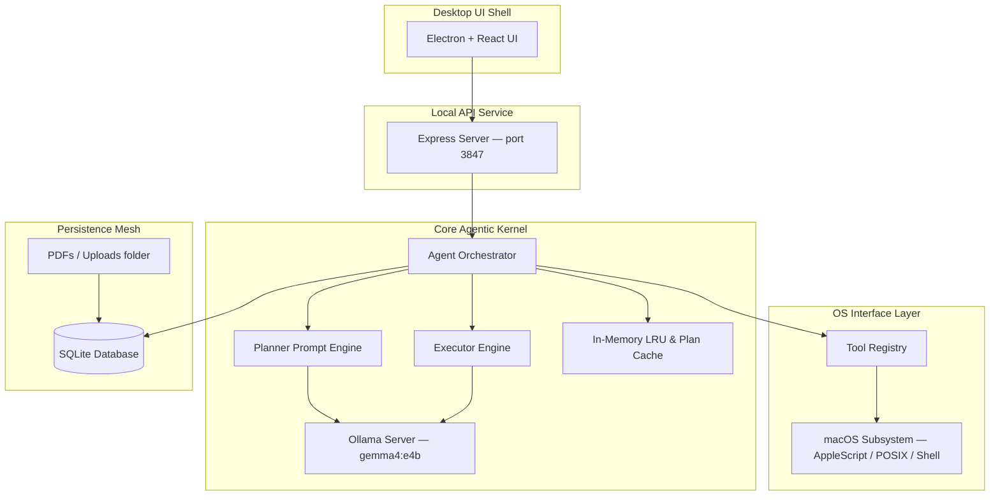

# ⚡ JarvisOS: Local-First Agentic Workstation Orchestrator

[](LICENSE)
[](package.json)
[](agent/src/orchestrator.test.ts)
[](#prerequisites)

**JarvisOS** is a local, offline-first agentic operating system layer built to automate, orchestrate, and control your macOS workstation. Powered by Google’s **Gemma 4 (E4B)** model running locally via Ollama, JarvisOS allows you to command your workstation through natural text and voice—translating user intents into structured execution plans and invoking native hardware hooks safely and privately without cloud telemetry.

---

## 🚀 Key Highlights & Features

- 🧠 **Local LLM Orchestration:** Custom-prompted local inference with Google's **Gemma 4 E4B** optimized for JSON tool emission.
- ⚡ **Instantaneous Dual-Layer Caching (Up to 300x Speedup):**
  - **Plan Cache:** Normalizes and caches query plans for 10 minutes, bypassing LLM planning latency entirely for repeated intents.
  - **Execution Summary Cache:** If tool execution results (`success`, `data`, `error`) are identical to a previous run, the agent reuses the natural language summary—reducing repeated launch commands (like *"Open Safari"*) to under **250ms**.
- 📂 **High-Performance Filesystem Cache:** Caches recursive folder walks for 15 seconds, making nested directory scans, searches, and PDF ingests instantaneous.
- 🛠️ **11 Native macOS Tools:**
  1.  **File System (`file`):** Read, move, delete, rename, list, or scan files inside Desktop, Downloads, and Documents.
  2.  **App Launcher (`app_launcher`):** Start/terminate applications via `open -a` (Chrome, VS Code, Slack, Zoom, finder, etc.).
  3.  **Browser Interface (`browser`):** Open URLs, search Google, or route queries. Falls back automatically to web search queries for browser targets.
  4.  **Terminal Sandbox (`terminal`):** Execute macOS shell commands securely.
  5.  **PDF Reader (`pdf`):** Extract text and structural parameters from documents.
  6.  **Quick Notes (`notes`):** Read, write, or delete logs in a local SQLite DB.
  7.  **Folder Scanner (`folder_scan`):** Traverses and gathers directory metadata.
  8.  **System Controller (`system`):** Adjust volume, check power stats, and inspect system resources.
  9.  **Calendar Integration (`calendar`):** Generates `.ics` calendar events.
  10. **Email Integrator (`email`):** Composes `.eml` email drafts instantly.
  11. **Presentation Suite (`presentation`):** Generates local HTML slide decks.
- 🎙️ **Voice Integration:** Low-latency speech-to-text using local `whisper.cpp` or cloud Deepgram.
- 💻 **Premium Visual Experience:** Rich dark-mode glassmorphic Electron + React dashboard featuring real-time Ollama status monitors, interactive chat, file drop zones, plan visualization panels, and a custom **About me** profile page.

---

## 🏛️ System Architecture



---

## 📦 Monorepo Layout

```text
jarvis-os/
├── frontend/         # Electron + React dashboard (Tailwind CSS, Lucide icons)
├── backend/          # Express API server (routes, DI container, RAG, cleanups)
├── agent/            # Core planner, executor, and local Ollama Client
├── tools/            # macOS tool registry & AppleScript wrappers
├── memory/           # SQLite store (messages, tasks, KV caching, RAG vector stubs)
├── voice/            # Speech-to-text transcriber (whisper.cpp & Deepgram integrations)
├── documents/        # PDF extraction and batch document summarizer
├── prompts/          # System prompt templates (*.system.md)
├── database/         # SQLite schema & SQL migrations
├── models/           # Ollama setup and model tuning guidelines
└── scripts/          # Setup, demonstration, and environment helpers
```

---

## ⚙️ Prerequisites

- **Host System:** macOS (required for POSIX/AppleScript system tools).
- **Runtime:** Node.js 20+ (Node 22 recommended).
- **LLM Engine:** [Ollama](https://ollama.com) serving model `gemma4:e4b` (minimum 4-bit quantization).
- **STT (Optional):** [whisper.cpp](https://github.com/ggerganov/whisper.cpp) for offline voice transcription, or a `DEEPGRAM_API_KEY` for cloud transcription.
- **Documents (Optional):** Python 3 + `PyMuPDF` for advanced PDF text extraction.

---

## 🚀 Getting Started

### 1. Model Provisioning
Download and start Ollama, then pull the targeted Gemma 4 model:
```bash
ollama serve
ollama pull gemma4:e4b
```

### 2. Installation
Clone the repository and run the automated setup script:
```bash
git clone https://github.com/addygeek/Jarvis-os.git
cd Jarvis-os
chmod +x scripts/setup.sh scripts/demo.sh
./scripts/setup.sh
```
*The setup script installs monorepo dependencies, links workspaces, creates a default `.env` file, and rebuilds the local `better-sqlite3` native binaries.*

---

## 🛠️ Development Workflow

Run the full stack (API + Vite UI) in parallel:
```bash
npm run dev
```
- **Backend API:** [http://127.0.0.1:3847](http://127.0.0.1:3847)
- **Vite React UI:** [http://localhost:5173](http://localhost:5173) (Proxies `/api` routes directly to the backend)

### Running Electron Desktop Dev Shell
Start the Electron wrapper to run the application as a native macOS window:
```bash
npm run electron:dev -w @jarvisos/frontend
```
*Use `JARVIS_SPAWN_BACKEND=1 npm run electron:dev -w @jarvisos/frontend` to auto-spawn the Express API server concurrently.*

### Run Tests
JarvisOS includes 49 unit tests verifying API endpoints, safety bounds, planner outputs, and tool integrations:
```bash
npm test
```

---

## ⚡ Caching Architecture (Why it's so fast)

JarvisOS employs a custom **multi-tier cache matrix** designed to bypass local inference latency for common desktop automation tasks:

```
User Query: "Open Safari"
  │
  ├──► [Plan Cache] ──(HIT)──► Retrieve Cached Plan
  │      │                       │
  │    (MISS)                  (Run Steps)
  │      │                       │
  │   Query Ollama             Exec: open -a Safari
  │   (3-5s Latency)             │
  │      │                       ▼
  │      └─────────────────► [Summary Cache] ──(HIT)──► Reuse "Safari opened" (Roundtrip: 240ms!)
  │                            │
  │                          (MISS)
  │                            │
  │                         Query Ollama to Summarize (10-15s Latency)
```

1.  **Intent Plan Cache:** When a request is made, the query string is normalized. If an identical intent was planned within the last 10 minutes, the planning step is bypassed (saving **3–5 seconds** of LLM latency).
2.  **Outcome Summary Cache:** Once the plan is executed, the tool outputs are compared to the cached run. If the outputs match exactly, the previously generated summary is returned directly, completely avoiding Ollama's summary generation (saving **10–15 seconds** of LLM latency).

---

## 🌐 API Reference

| Method | Endpoint | Description |
| :--- | :--- | :--- |
| `GET` | `/api/health` | Service health status & registered macOS tools |
| `POST` | `/api/chat` | Main assistant chat endpoint (with automatic planning & execution) |
| `POST` | `/api/plan` | Accepts an intent string and returns a structured JSON execution plan |
| `POST` | `/api/execute` | Executes a provided JSON execution plan |
| `GET` | `/api/tools` | Returns schemas for the 11 registered macOS tools |
| `POST` | `/api/tools/execute` | Directly executes a target tool (used for debug/testing) |
| `POST` | `/api/voice/transcribe` | Transcribes multipart audio uploads into text |
| `GET` | `/api/search?q=...` | Fast recursive desktop/downloads/documents file search |
| `POST` | `/api/research/summarize` | Batch summarizes documents and PDFs in a target folder |
| `DELETE`| `/api/agent/cache` | Flushes all plan, tool, and summary caches |

---

## 🎨 Meet the Creator

JarvisOS is built and maintained by **Aditya Kumar**. You can connect with Aditya or explore his other AI initiatives through the links below:

- **Portfolio / Website:** [darexai.com](https://darexai.com)
- **GitHub:** [@addygeek](https://github.com/addygeek)
- **LinkedIn:** [Aditya Kumar](https://www.linkedin.com/in/aditya-kumar-learner/)
- **Email:** aditya@darexai.com
- **Phone / WhatsApp:** +91 9119267828

---

## 📄 License

This repository is licensed under the [MIT License](LICENSE). Feel free to inspect, modify, fork, or use it in your open-source projects!
