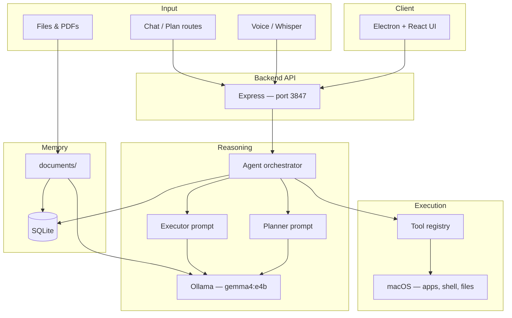

# JarvisOS

**Private offline AI operating system assistant for macOS** — voice and text commands, local reasoning with Gemma via [Ollama](https://ollama.com), tool execution on your Mac, and document research. No cloud required for the MVP.

Full product spec: **[prd.md](prd.md)** · **5-minute setup: [QUICKSTART.md](QUICKSTART.md)**

## Architecture



## Monorepo layout

| Package      | Role                                         |
| ------------ | -------------------------------------------- |
| `frontend/`  | Electron + React desktop UI                  |
| `backend/`   | Express API, wires agent + tools             |
| `agent/`     | Planner, executor, chat orchestration        |
| `tools/`     | macOS tool implementations                   |
| `memory/`    | SQLite conversations & tasks                 |
| `voice/`     | Whisper STT (`POST /api/voice/transcribe`, mounted in backend) |
| `documents/` | PDF extract + Ollama summarization           |
| `prompts/`   | System prompts for planner / executor / chat |
| `database/`  | `schema.sql`                                 |
| `models/`    | Ollama model setup guide                     |
| `scripts/`   | `setup.sh`, `demo.sh`                        |

## Prerequisites

| Requirement                       | Notes                                                                        |
| --------------------------------- | ---------------------------------------------------------------------------- |
| **macOS**                         | Primary target; tools use AppleScript, `open`, and user folders              |
| **Node.js 20+**                   | Monorepo workspaces                                                          |
| **Ollama**                        | Default model **`gemma4:e4b`** — see [models/README.md](models/README.md)    |
| **whisper.cpp** (optional)        | Faster STT than the dev fallback in `@jarvisos/voice`                        |
| **Python 3 + PyMuPDF** (optional) | Stronger PDF text extraction in `@jarvisos/documents`                        |

## Install

```bash
git clone <your-repo-url> jarvisos
cd jarvisos

chmod +x scripts/setup.sh scripts/demo.sh
./scripts/setup.sh       # npm install, .env, workspace builds

ollama pull gemma4:e4b   # default OLLAMA_MODEL — see models/README.md
cp .env.example .env     # if setup did not create .env
```

The memory layer creates `database/jarvisos.db` and applies `database/schema.sql` on first backend start.

## Development

Start **Ollama** in a separate terminal if it is not already running:

```bash
ollama serve
```

Run API + Vite UI together (recommended):

```bash
npm run dev
```

| Service   | URL |
| --------- | --- |
| Backend   | `http://127.0.0.1:3847` |
| Vite UI   | `http://localhost:5173` (proxies `/api` → `:3847`) |

Or run them separately:

```bash
npm run dev:backend    # http://127.0.0.1:3847
npm run dev:frontend   # http://localhost:5173
```

Electron desktop shell:

```bash
npm run electron:dev -w @jarvisos/frontend
```

On launch, Electron checks `GET /api/health` on port **3847** and shows a dialog if the API is down. In dev only, you can auto-start the backend:

```bash
JARVIS_SPAWN_BACKEND=1 npm run electron:dev -w @jarvisos/frontend
```

Build TypeScript workspaces:

```bash
npm run build
# or core only (no frontend):
npm run build:core
```

### API routes (MVP)

| Method | Path | Purpose |
| ------ | ---- | ------- |
| `GET` | `/api/health` | Ollama + tool registry status |
| `POST` | `/api/chat` | Chat (optional plan + execution); **no SSE stream** |
| `POST` | `/api/plan` | Plan only |
| `POST` | `/api/execute` | Execute a plan |
| `GET` | `/api/tools` | List tools for the UI |
| `POST` | `/api/tools/execute` | Debug: run one tool |
| `POST` | `/api/voice/transcribe` | Multipart `audio` → text (`@jarvisos/voice`) |
| `GET` | `/api/voice/health` | Voice engine status (whisper-cli / Deepgram) |
| `POST` | `/api/files/upload` | Multipart `files` → `data/uploads/` (or `UPLOADS_DIR`) |
| `GET` | `/api/search?q=` | Search Desktop / Downloads / Documents |
| `POST` | `/api/research/summarize` | PDF batch summarization |
| `GET`/`POST` | `/api/memory/*` | Conversations, tasks, KV memory |
| `POST` | `/api/knowledge/*` | RAG ingest/query (in-memory stub) |

**Tools:** `calendar`, `email`, and `presentation` are real macOS/file tools (Calendar.app, Mail drafts, HTML decks under `~/JarvisOS/`). **`POST /api/presentations/generate`** is still a stub API route — see [INTEGRATION.md](INTEGRATION.md).

Environment variables: [.env.example](.env.example) (backend vars match `backend/src/config.ts`). Defaults: **`PORT=3847`**, **`OLLAMA_MODEL=gemma4:e4b`**.

## Production build

Backend (API only):

```bash
npm run build:core
npm run start -w @jarvisos/backend
```

Package the macOS desktop app:

```bash
npm run build:core
cd frontend
npm run package          # electron-builder → DMG in frontend/release/
```

**DMG prerequisites (macOS):**

- Run from `frontend/` after `npm run build:core` at repo root (the DMG bundles the UI only, not the API).
- `electron-builder` targets `dmg` per `frontend/package.json` → `"build"` (includes `electronVersion` for npm workspaces).
- App icon: `frontend/build/icon.icns` (replace with your own `.icns` for release branding).
- Output: `frontend/release/JarvisOS-<version>-arm64.dmg` (verified on Apple Silicon).
- Unsigned local builds: right-click the app → **Open** the first time, or allow in **Privacy & Security**.
- Code signing / notarization are not configured — add Apple Developer credentials to `"build.mac"` for distribution outside your machine.

The packaged app expects the backend at `http://127.0.0.1:3847` (`VITE_API_URL` at build time). Start the API before or alongside the `.app`.

## Remaining gaps (honest)

| Area | Status |
|------|--------|
| **Packaged app + API** | DMG ships UI only; run `npm run start -w @jarvisos/backend` (and Ollama) separately |
| **RAG / knowledge** | In-memory stub by default; optional `JARVIS_VECTOR_BACKEND=lancedb` in `memory/rag` |
| **Streaming chat** | No `POST /api/chat/stream`; UI uses non-streaming `POST /api/chat` only |
| **Presentations API** | `POST /api/presentations/generate` returns a stub outline, not a generated deck |
| **Code signing** | Not set up for production macOS distribution |

Details: [INTEGRATION.md](INTEGRATION.md).

## Demo

With the backend running:

```bash
./scripts/demo.sh
```

Or:

```bash
npm run demo
```

The script hits `/api/health`, lists tools, creates a plan, sends chat messages, and runs a sample `system` tool call.

## Troubleshooting

| Symptom                    | What to try                                                                                             |
| -------------------------- | ------------------------------------------------------------------------------------------------------- |
| **Ollama unreachable**     | `ollama serve`, then `curl http://127.0.0.1:11434/api/tags`                                             |
| **Model missing**          | `ollama pull gemma4:e4b` and set `OLLAMA_MODEL` in `.env`                                               |
| **Wrong API port**         | Default is **3847**; align `PORT`, `VITE_API_URL`, and `JARVIS_API_URL`                                 |
| **CORS errors from Vite**  | Add your dev origin to `CORS_ORIGINS` in `.env`                                                         |
| **Whisper not found**      | Install [whisper.cpp](https://github.com/ggerganov/whisper.cpp) or set `WHISPER_CLI`                      |
| **PDF extraction weak**    | `pip install pymupdf` and ensure `PYTHON=python3`                                                       |
| **Tool permission errors** | Grant Terminal / app automation access in **System Settings → Privacy & Security**                      |
| **Electron backend dialog**| Run `npm run dev` or `npm run dev:backend`; optional `JARVIS_SPAWN_BACKEND=1` for dev auto-start        |

## Contributing

See [CONTRIBUTING.md](CONTRIBUTING.md) for monorepo conventions, adding tools, and prompt guidelines.

## License

[MIT](LICENSE)
# Jarvis-os
