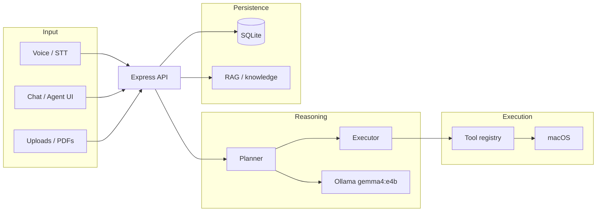

# Project overview

JarvisOS is a **private, offline-first AI operating system assistant for macOS**. Users interact by voice or text; a local reasoning layer (Gemma via Ollama) plans actions; a tool layer executes them on the Mac (files, apps, terminal, calendar, and more). The MVP does not require cloud LLM APIs for core chat and planning.

**Version:** `0.1.0` (MVP) · **Product spec:** [prd.md](../prd.md)

---

## One-line vision

An offline assistant that understands natural language and **controls the computer locally** — open folders, search files, summarize PDFs, run shell commands, and draft calendar or mail actions — without sending prompts to a hosted model by default.

---

## Problem and solution

| Problem | JarvisOS approach |
| ------- | ----------------- |
| Siri and web assistants are disconnected from local files and apps | Tools call macOS APIs (`open`, AppleScript, user folders) |
| Cloud assistants raise privacy concerns for research and personal data | Ollama runs **Gemma 4 E4B** (`gemma4:e4b`) on the machine |
| Multi-step tasks need manual glue work | **Planner → executor** agent loop with a registered tool set |

Example interaction (from the PRD):

> User: “Open Chrome and navigate to ACL Anthology.”  
> Jarvis: plans steps → runs `browser` / `app_launcher` tools → confirms.

---

## Target users

From [prd.md](../prd.md):

| Segment | Use cases |
| ------- | --------- |
| **Primary — researchers** | PDF summarization, literature search, organized Downloads |
| **Secondary — students** | Notes, presentations, desktop cleanup |
| **Tertiary — developers** | Terminal tool, code routes, local experimentation |
| **Knowledge workers / future** | Calendar, email drafts, file organization |

The codebase is optimized for **macOS** (AppleScript, standard user directories, Electron desktop shell).

---

## High-level architecture

**Typical chat flow:** UI `POST /api/chat` → `AgentOrchestrator` → optional plan + tool execution → messages stored in SQLite → JSON response.

**Typical action flow:** User message matches action heuristics → planner returns JSON steps → executor runs each tool → summary returned.

See [INTEGRATION.md](../INTEGRATION.md) for package-level wiring.

---

## Monorepo layout

| Path | NPM workspace | Role |
| ---- | ------------- | ---- |
| `frontend/` | `@jarvisos/frontend` | Electron + React dashboard (chat, voice, tools, settings) |
| `backend/` | `@jarvisos/backend` | Express HTTP API on port **3847** |
| `agent/` | `@jarvisos/agent` | Planner, executor, Ollama client, orchestration |
| `tools/` | `@jarvisos/tools` | Eleven macOS tool implementations + registry |
| `memory/` | `@jarvisos/memory` | SQLite conversations, tasks, KV facts; RAG module |
| `voice/` | `@jarvisos/voice` | Speech-to-text (Deepgram or whisper.cpp) |
| `documents/` | `@jarvisos/documents` | PDF extract + Ollama summarization |
| `prompts/` | — | System prompts for planner / executor / chat |
| `database/` | — | `schema.sql` applied on first backend start |
| `models/` | — | Ollama model documentation |
| `scripts/` | — | `setup.sh`, `demo.sh`, dev URL helper |

Supporting directories: `data/uploads/` (runtime uploads), `database/jarvisos.db` (created automatically).

---

## What the MVP includes (verified)

| Area | Status |
| ---- | ------ |
| Monorepo build (`npm run build`) | ✅ All workspaces compile |
| Unit tests (`npm test`) | ✅ backend, tools, agent (see [STATUS.md](../STATUS.md)) |
| Chat and planning with Ollama | ✅ Default model `gemma4:e4b` |
| **11 tools** in registry | ✅ See [03-glossary.md](./03-glossary.md#tool-registry) |
| SQLite conversation memory | ✅ `database/jarvisos.db` |
| Research PDF pipeline | ✅ `POST /api/research/summarize` |
| Voice API | ✅ Mounted at `/api/voice` (engine depends on env) |
| Electron dev + DMG packaging | ✅ UI artifact; API runs separately |
| Streaming SSE endpoint | ✅ `POST /api/chat/stream` (used by Voice UI; Chat page still uses non-streaming `/api/chat`) |

---

## Known limitations (honest)

| Area | Notes |
| ---- | ----- |
| **Packaged DMG** | Ships the UI only; start backend + Ollama separately |
| **RAG / knowledge** | In-memory vector store by default; `JARVIS_VECTOR_BACKEND=lancedb` still falls back to memory until LanceDB is integrated |
| **Chat streaming in UI** | Main Chat page uses `POST /api/chat`; Voice uses `/api/chat/stream` |
| **Presentations HTTP API** | `POST /api/presentations/generate` is a stub; real decks use the `presentation` **tool** under `~/JarvisOS/presentations/` |
| **Code signing** | Not configured for notarized macOS distribution |
| **Security** | File and terminal tools can modify the system — intended for trusted local dev |

Details: [04-roadmap-and-status.md](./04-roadmap-and-status.md).

---

## Default ports and services

| Service | Default URL / port |
| ------- | ------------------ |
| JarvisOS API | `http://127.0.0.1:3847` |
| Vite dev UI | `http://localhost:5173` |
| Ollama | `http://127.0.0.1:11434` |

---

## Next steps for readers

- **Run locally:** [02-getting-started.md](./02-getting-started.md)
- **Terminology:** [03-glossary.md](./03-glossary.md)
- **Roadmap and gaps:** [04-roadmap-and-status.md](./04-roadmap-and-status.md)
