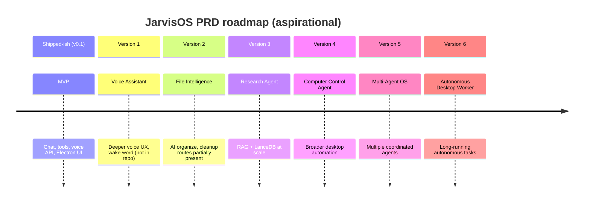

# Roadmap and status

Synthesis of [STATUS.md](../STATUS.md), [INTEGRATION.md](../INTEGRATION.md), and [prd.md](../prd.md), cross-checked against the codebase as of the last verification date in STATUS (**2026-05-29**).

---

## Current release

| Field | Value |
| ----- | ----- |
| **Version** | `0.1.0` (MVP) |
| **Platform** | macOS (primary) |
| **Default model** | `gemma4:e4b` via Ollama |
| **Stack** | Electron + React, Express, SQLite, local tools |

---

## Verification snapshot

From [STATUS.md](../STATUS.md):

| Check | Result |
| ----- | ------ |
| `npm run build` | Pass |
| `npm test` | Pass (38 tests: backend, tools, agent) |
| `/api/health` | Reports `gemma4:e4b`, `modelAvailable: true` when Ollama is up |
| `/api/chat` | Returns LLM text from Ollama |
| Demo routes (tools, search, research, memory) | HTTP 200 |
| Electron DMG | Built (`JarvisOS-0.1.0-arm64.dmg`); UI-only artifact |

Re-run locally:

```bash
npm run build && npm test
curl -s http://127.0.0.1:3847/api/health
./scripts/demo.sh
```

---

## MVP feature matrix (PRD vs shipped)

PRD MVP themes from [prd.md](../prd.md#mvp-features) mapped to implementation:

| PRD feature | MVP intent | Shipped status |
| ----------- | ---------- | -------------- |
| Voice commands | STT + assistant | ✅ API `/api/voice`; UI Voice page; STT needs Deepgram or whisper.cpp |
| Desktop search | Find files in user folders | ✅ `GET /api/search`, `folder_scan` / `file` tools |
| Research assistant | Summarize PDFs | ✅ `POST /api/research/summarize`, `pdf` tool, documents package |
| App control | Launch apps, browser | ✅ `app_launcher`, `browser` tools |
| System actions | Volume, settings | ✅ `system` tool |
| Calendar / email / decks | Productivity | ✅ `calendar`, `email`, `presentation` tools (local/macOS) |
| Agent planning | Plan → execute | ✅ Planner + executor; `/api/plan`, `/api/execute`, `/api/chat` |
| Memory | Persist conversations | ✅ SQLite via `@jarvisos/memory` |
| Knowledge / RAG | Long-term doc Q&A | ⚠️ API exists; **in-memory vectors only** by default |
| Streaming UX | Responsive replies | ⚠️ **`/api/chat/stream` implemented**; main Chat UI still uses non-streaming `/api/chat` |
| Packaged installer | One-click app | ⚠️ DMG = **UI only**; no bundled backend/Ollama |
| Presentations API | HTTP generate deck | ❌ Stub route; use `presentation` tool |

---

## Architecture roadmap (PRD future versions)

Long-term product phases from [prd.md](../prd.md#future-roadmap):



These version labels are **product direction**, not semver releases in `package.json`.

---

## PRD advanced features (partial / planned)

| PRD advanced feature | Codebase notes |
| -------------------- | -------------- |
| AI file organization | `POST /api/organize` and file-organizer service exist |
| AI desktop cleanup | `POST /api/cleanup` and desktop-cleanup service exist |
| AI knowledge base | `POST /api/knowledge/*` + `memory/rag`; durability incomplete |
| Screenshot input | PRD input layer; not a first-class MVP route in integration docs |
| Native Gemma audio | PRD “future” for speech; not implemented |

---

## Known gaps (prioritized)

Aligned with [INTEGRATION.md](../INTEGRATION.md#remaining-gaps-honest) and source review:

### P0 — user-visible polish

| Gap | Detail | Suggested direction |
| --- | ------ | ------------------- |
| **Chat UI streaming** | `POST /api/chat/stream` works; [Chat.tsx](../frontend/src/pages/Chat.tsx) uses `api.sendChat` → `/api/chat` only | Wire Chat to `api.streamChatFull` or shared SSE helper |
| **Shippable backend for DMG users** | Packaged app expects API on `:3847` but does not start it | Menubar helper, launch agent, or bundle sidecar Node process |

### P1 — data and APIs

| Gap | Detail | Suggested direction |
| --- | ------ | ------------------- |
| **Durable RAG** | `JARVIS_VECTOR_BACKEND=lancedb` logs warning and uses memory | Implement LanceDB adapter in `memory/rag/vector-store.ts` |
| **Presentations HTTP** | `presentations` route returns stub outline | Delegate to `presentation` tool or remove stub |
| **Code signing / notarization** | Ad-hoc DMG only | Apple Developer `build.mac` credentials in `frontend/package.json` |

### P2 — security and scale

| Gap | Detail |
| --- | ------ |
| **Tool power** | Terminal/file tools can modify the system — trusted machine only |
| **Model cold start** | First `/api/plan` can be slow until Ollama warms |
| **Optional cloud STT** | Deepgram requires API key; not “fully offline” for voice |

---

## Streaming status (nuanced)

Older docs state “no `/api/chat/stream`.” The route **exists** and is mounted in `backend/src/app.ts`:

```text
POST /api/chat/stream  →  chat-stream.ts (SSE: token, plan, step_*, done)
```

| Surface | Uses streaming? |
| ------- | --------------- |
| Voice page | ✅ `api.streamChatFull` |
| Chat page | ❌ `api.sendChat` → `/api/chat` |
| Agent page | ✅ `api.streamAgentTask` → `/api/agent/stream` |

**Next step:** unify Chat on SSE for token-by-token replies (STATUS.md item #1).

---

## RAG status

| Mode | Behavior |
| ---- | -------- |
| Default | `InMemoryVectorStore` — embeddings in process; data lost on restart |
| `JARVIS_VECTOR_BACKEND=lancedb` | Warns and falls back to memory (`vector-store.ts`) |

**Next step:** ship LanceDB (or SQLite FTS) adapter and document ingest paths for research Q&A (STATUS.md item #3).

---

## Top next steps (from STATUS.md)

1. **Streaming chat in main UI** — Connect Chat to `/api/chat/stream` for responsive replies (backend route already present).
2. **Shippable backend** — Launcher or menubar helper so DMG users can start API + Ollama without Terminal.
3. **Durable RAG** — Real vector persistence and ingestion pipeline for document Q&A.

---

## MVP checklist (integration doc)

| Item | Status |
| ---- | ------ |
| Monorepo build | ✅ |
| Unit tests | ✅ |
| Ollama `gemma4:e4b` | ✅ |
| `/api/health` + model | ✅ when Ollama running |
| `/api/chat` | ✅ |
| `/api/plan` | ✅ |
| Tool registry (11 tools) | ✅ |
| Search, research, memory | ✅ |
| Voice router | ✅ (engine config-dependent) |
| `scripts/demo.sh` | ✅ |
| Electron DMG | ✅ UI only |
| Streaming in Chat UI | ❌ |
| Production RAG (LanceDB) | ❌ |
| DMG bundles backend/Ollama | ❌ |
| Code signing | ❌ |

---

## Technology choices (PRD vs repo)

| Layer | PRD mention | Repo reality |
| ----- | ----------- | ------------ |
| UI | Electron + React | ✅ `@jarvisos/frontend` |
| Backend | Node.js | ✅ Express |
| LLM | Gemma 4 E4B | ✅ Ollama `gemma4:e4b` |
| STT | Whisper.cpp | ✅ Optional; Deepgram optional |
| Memory | SQLite | ✅ |
| Vectors | LanceDB, Qdrant | LanceDB stub only; in-memory default |
| PDF | PyMuPDF | ✅ Optional via `PYTHON` |

---

## How to update this doc

When shipping a feature:

1. Update [STATUS.md](../STATUS.md) verification table.
2. Adjust the MVP matrix and checklist in this file.
3. Remove or downgrade items from **Known gaps** when fixed in code.

---

## See also

- [01-project-overview.md](./01-project-overview.md)  
- [02-getting-started.md](./02-getting-started.md)  
- [03-glossary.md](./03-glossary.md)  
- [prd.md](../prd.md) — full requirements and demo script
