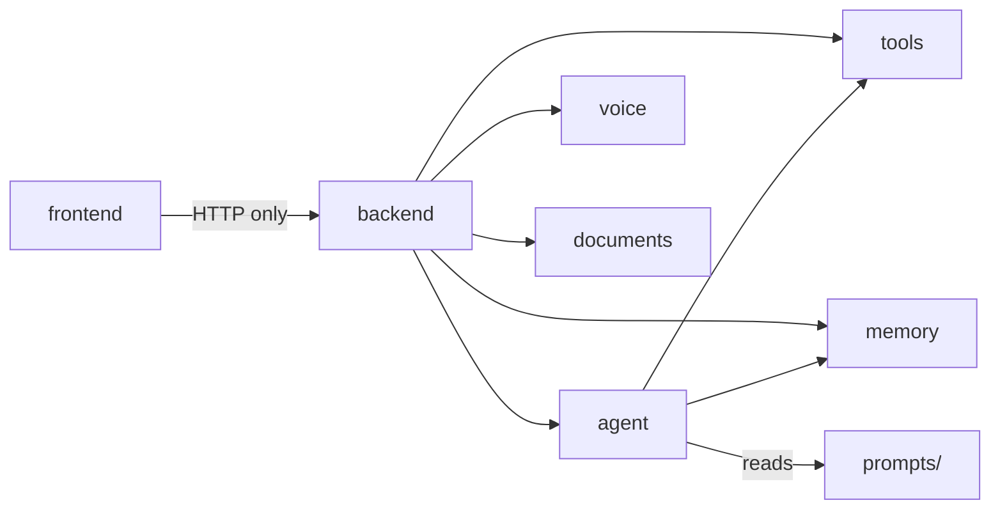

# High-level architecture

**See also:** [docs index](../README.md) · [02 Request lifecycle](02-request-lifecycle.md) · [INTEGRATION.md](../../INTEGRATION.md)

JarvisOS is a **local-first macOS assistant**: a React/Electron UI talks to an Express API, which orchestrates an Ollama-backed agent, macOS tool execution, SQLite memory, and optional voice/document pipelines. There is no `apps/` directory—the monorepo uses **npm workspaces** with top-level packages.

## System context

```mermaid
flowchart TB
  subgraph client [Client tier]
    Browser[Vite dev :5173]
    Electron[Electron shell]
    UI[React SPA]
    Browser --> UI
    Electron --> UI
  end

  subgraph api [API tier — backend :3847]
    Express[Express createApp]
    DI[getContainer singleton]
    Express --> DI
  end

  subgraph core [Core packages]
    Agent[@jarvisos/agent]
    Tools[@jarvisos/tools]
    Memory[@jarvisos/memory]
    Docs[@jarvisos/documents]
    Voice[@jarvisos/voice]
  end

  subgraph local [Local services]
    Ollama[Ollama :11434]
    SQLite[(database/jarvisos.db)]
    FS[macOS filesystem / apps]
  end

  UI -->|HTTP /api| Express
  DI --> Agent
  DI --> Tools
  DI --> Memory
  Express --> Docs
  Express --> Voice
  Agent --> Ollama
  Agent --> Tools
  Agent --> Memory
  Tools --> FS
  Memory --> SQLite
  Voice -->|optional| Whisper[whisper.cpp / Deepgram]
  Docs --> Ollama
```

## Monorepo layout

Root: `package.json` (`name: jarvisos`) defines workspaces and orchestration scripts (`dev`, `build`, `build:core`).

| Path | NPM package | Responsibility |
|------|-------------|----------------|
| `frontend/` | `@jarvisos/frontend` | React 18 UI, Vite, Electron main/preload |
| `backend/` | `@jarvisos/backend` | HTTP API, route mounting, DI container |
| `agent/` | `@jarvisos/agent` | Planner, executor, orchestrator, Ollama client |
| `tools/` | `@jarvisos/tools` | `ToolRegistry` + 11 macOS tools |
| `memory/` | `@jarvisos/memory` | SQLite `MemoryStore`; `memory/rag/` for knowledge |
| `voice/` | `@jarvisos/voice` | STT router (`createVoiceRouter`) |
| `documents/` | `@jarvisos/documents` | PDF extract + Ollama summarization |
| `prompts/` | — | `*.system.md` templates loaded by agent |
| `database/` | — | `schema.sql` applied on first DB open |
| `models/` | — | Ollama model setup notes |
| `scripts/` | — | `setup.sh`, `demo.sh`, `dev-urls.mjs` |
| `data/` | — | Runtime uploads (`UPLOADS_DIR`) |

Supporting paths: `tools/coverage/` (Vitest JSON summary), `frontend/release/` (electron-builder DMG output).

## Dependency graph (compile-time)



The frontend does **not** import agent/tools/memory at build time for production logic—it uses REST (`frontend/src/lib/api.ts`). Workspace packages are linked for types and dev consistency.

## Runtime processes

| Process | Default | Entry |
|---------|---------|--------|
| Backend API | `127.0.0.1:3847` | `backend/src/index.ts` → `createApp()` |
| Vite dev server | `127.0.0.1:5173` | `frontend/vite.config.ts` proxies `/api` → `:3847` |
| Ollama | `127.0.0.1:11434` | External; `OLLAMA_MODEL` default `gemma4:e4b` |
| Electron (optional) | Loads Vite URL or `dist/index.html` | `frontend/electron/main.ts` |

`npm run dev` (root) runs backend + frontend via `concurrently` (`package.json`).

## Composition root

`backend/src/services/container.ts` constructs a lazy singleton:

1. `MemoryStore(appConfig.databasePath)` — migrates from `database/schema.sql`
2. `OllamaClient` from `appConfig.ollama`
3. `AgentOrchestrator(ollama, toolRegistry, memory)`

`backend/src/index.ts` warms the container on listen and shuts down SQLite on `SIGINT`/`SIGTERM`.

## API surface (mount points)

Routes are registered in `backend/src/app.ts`:

- Core: `/api/health`, `/api/chat`, `/api/chat/stream`, `/api/plan`, `/api/execute`
- Agent: `/api/agent`, `/api/agent/stream`
- Memory: `/api/memory`, knowledge: `/api/knowledge`
- Files/search, tools, research, presentations, voice, organize, cleanup, code

Voice is mounted as `@jarvisos/voice/server` → `createVoiceRouter()` at `/api/voice`.

## Deployment model

**Development:** Three cooperating processes (Ollama, backend, Vite/Electron). Env from repo-root `.env` via `backend/src/config.ts` and `frontend/electron/load-env.ts`.

**Production DMG (`frontend` electron-builder):**

- Ships **UI only** (`frontend/dist` + `dist-electron/`)
- Does **not** bundle Node backend, Ollama, SQLite, or whisper models
- Main process checks `GET {API_BASE}/api/health` before showing the window (`frontend/electron/main.ts`)
- Opt-in dev spawn: `JARVIS_SPAWN_BACKEND=1` starts `npm run dev -w @jarvisos/backend`

**Tradeoff:** Simple packaging and clear separation of concerns vs. multi-step install for end users (documented in `INTEGRATION.md`).

## Security boundary

Tools execute shell commands, file I/O, and AppleScript on the **host Mac**. The stack assumes a **trusted local machine**—no multi-tenant isolation, no sandbox beyond Electron renderer `contextIsolation` + `sandbox: true`. Terminal safety uses allowlists and blocked patterns in `tools/src/utils/safety.ts`.

## Build order

`npm run build` compiles workspaces in dependency order: tools → memory → agent → documents → voice → backend → frontend (`package.json` `build` script). `build:core` skips frontend/documents/voice for API-only workflows.

## Key design choices

| Choice | Rationale | Cost |
|--------|-----------|------|
| Single Express API | One port, simple Electron health check | All features scale with one process |
| Planner + executor split | JSON plans vs. step summaries; Ollama tool_calls path | Two LLM calls on multi-step tasks |
| SQLite for chat memory | Offline, file-backed, WAL mode | RAG vectors not persisted in MVP |
| In-memory vector store default | No LanceDB dependency | Knowledge lost on API restart |
| `stream: false` in agent Ollama client | Simpler planner/executor | Streaming implemented separately in `chat-stream.ts` |

## Related files

- `INTEGRATION.md` — ports, env table, MVP checklist
- `backend/src/config.ts` — `PORT`, `DATABASE_PATH`, Ollama tuning
- `agent/src/orchestrator.ts` — chat vs. actionable routing
- `package.json` — workspace list and scripts
