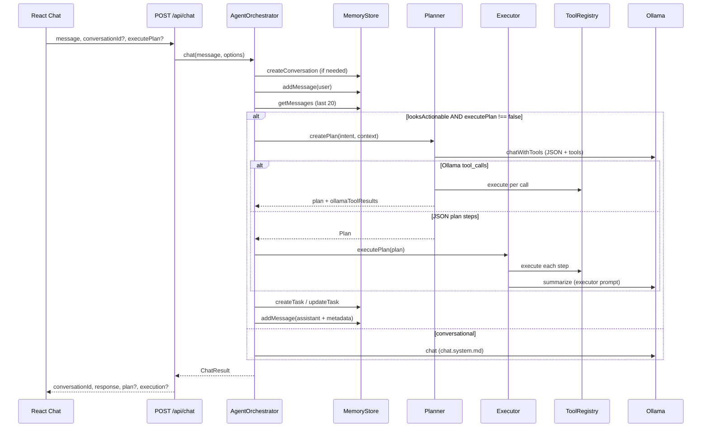
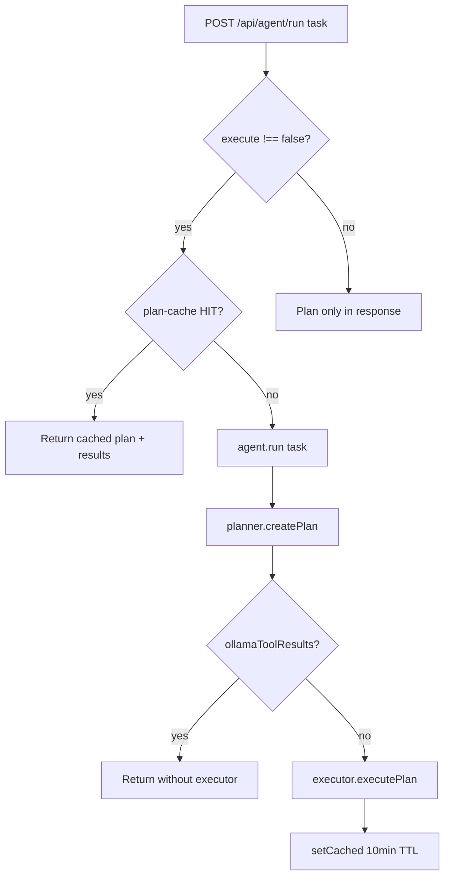
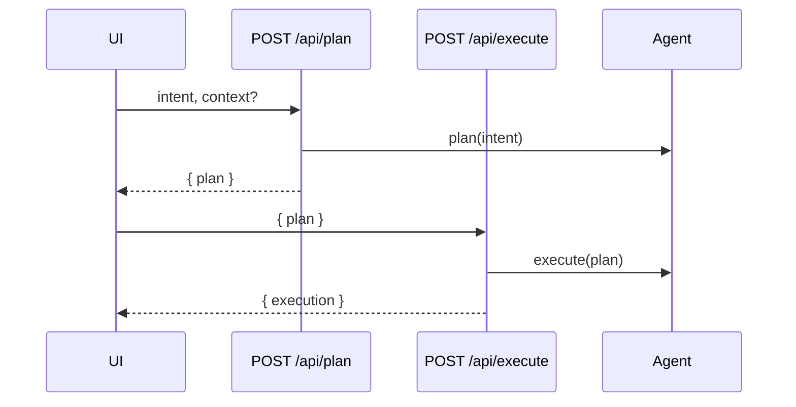

# Request lifecycle

**See also:** [docs index](../README.md) · [01 High-level](01-high-level-architecture.md) · [04 Tools](04-tools-and-plugins.md)

This document traces how user input becomes a persisted assistant reply, including planning, tool execution, and SSE variants.

## Endpoints overview

| Mode | Method | Path | Handler | Uses orchestrator? |
|------|--------|------|---------|-------------------|
| Chat (JSON) | POST | `/api/chat` | `backend/src/routes/chat.ts` | Yes — `agent.chat()` |
| Chat (SSE) | POST | `/api/chat/stream` | `backend/src/routes/chat-stream.ts` | Partial — plan/tools inline |
| Plan only | POST | `/api/plan` | `backend/src/routes/plan.ts` | `agent.plan()` |
| Execute plan | POST | `/api/execute` | `backend/src/routes/execute.ts` | `agent.execute()` |
| Agent run | POST | `/api/agent/run` | `backend/src/routes/agent.ts` | `agent.run()` |
| Agent (SSE) | POST | `/api/agent/stream` | `backend/src/routes/stream.ts` | Plan + per-step tools |

Frontend client: `frontend/src/lib/api.ts` (`chat`, `streamChatFull`, `streamAgentTask`, etc.).

## Primary chat flow (JSON)

### Actionable heuristic

`AgentOrchestrator.looksActionable()` (`agent/src/orchestrator.ts`):

1. **Skips** planning for “pure question” prefixes (`what is`, `explain`, `define`, …).
2. **Triggers** planning when message matches a large **action verb** regex (`open`, `find`, `run`, `send`, …).

`executePlan: false` forces the conversational path even for action-like text.

### Planner branches

`Planner.createPlan()` (`agent/src/planner.ts`):

| Outcome | Next step |
|---------|-----------|
| Ollama returns `tool_calls` | Execute immediately via `tools.execute`; return `ollamaToolResults` |
| JSON body with `steps[]` | Parsed by `parsePlanJson()` → executor runs steps |
| Parse failure | Fallback single `system` / `get_volume` step |

System prompt: `prompts/planner.system.md` with `{{TOOLS_LIST}}`, `{{CONTEXT}}`, `{{USER_INTENT}}`.

### Executor summary

`Executor.executePlan()` runs steps **sequentially** (no parallel steps). After all steps, `summarize()` calls Ollama with `prompts/executor.system.md` and step outcomes (`agent/src/executor.ts`).

## Agent task flow (`/api/agent/run`)

Used by the **Agent** page and capability execution:

Cache: `backend/src/services/plan-cache.ts` (keyed by task string).

Capabilities: `POST /api/agent/execute-capability` maps catalog IDs to direct `tools.execute()` (`backend/src/services/agent-capabilities.ts`, `backend/src/data/capabilities-catalog.ts`).

## SSE: chat stream

`POST /api/chat/stream` (`backend/src/routes/chat-stream.ts`) duplicates the actionable heuristic (`looksActionable`) and streams events:

| Event | Payload | When |
|-------|---------|------|
| `token` | `{ text }` | Ollama NDJSON stream chunk |
| `plan` | `{ intent, steps[] }` | After `agent.plan()` |
| `step_start` / `step_done` | step metadata | Per tool step |
| `summary` | (via streamed tokens) | Post-execution summary prompt |
| `error` | `{ message }` | Failures |
| `done` | `{ conversationId? }` | End |

**Note:** This route calls `tools.execute` directly for steps—not `Executor.summarize()`—then streams a short Ollama summary. Token streaming uses a local `fetch` to Ollama with `stream: true` (agent package uses `stream: false`).

Frontend: `api.streamChatFull()` in `frontend/src/lib/api.ts` (Voice + Chat streaming UX).

## SSE: agent stream

`POST /api/agent/stream` (`backend/src/routes/stream.ts`):

Events: `plan` → `step_start` → `step_done` → `summary` → `done`. Used by `api.streamAgentTask()` for live Agent UI step updates.

## Plan / execute split (API-level)

`frontend/src/lib/api.ts` also offers `runPlanPipeline()` (plan then execute in one UX flow without SSE).

## Ollama interaction

`OllamaClient` (`agent/src/ollama-client.ts`):

- `healthCheck()` → `GET /api/tags`, model match via `isOllamaModelAvailable()`
- `chat()` / `chatWithTools()` → `POST /api/chat`, **`stream: false`**
- Options: `num_gpu`, `flash_attn`, `num_ctx`, `use_mlock` (Apple Silicon defaults)

Config source: `backend/src/config.ts` → passed into container.

## Persistence side effects

Every successful `chat()` path:

1. Inserts **user** message
2. Inserts **assistant** message; optional `metadata: { plan, execution }`
3. On actionable runs: **task** row `running` → `completed` | `failed`

Message roles: `user` | `assistant` | `system` | `tool` (`memory/src/types.ts`).

## Error handling

- Route wrappers use `asyncHandler` + `HttpError` (`backend/src/middleware/error-handler.js`)
- Ollama down: conversational path returns install instructions (no throw)
- Tool failure: step `success: false`; executor summary still runs; chat may append error text on thrown executor errors

## Related files

| File | Role |
|------|------|
| `agent/src/orchestrator.ts` | Chat branching, task records |
| `agent/src/planner.ts` | Plan + Ollama tool_calls |
| `agent/src/executor.ts` | Sequential execution + summary |
| `backend/src/routes/chat.ts` | JSON chat API |
| `backend/src/routes/chat-stream.ts` | SSE chat |
| `frontend/src/pages/Chat.tsx` | Chat UI |
| `frontend/src/pages/Agent.tsx` | Agent / stream UI |
