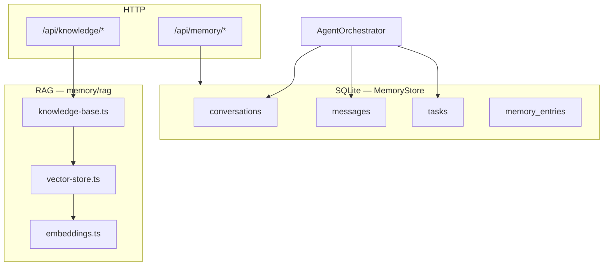
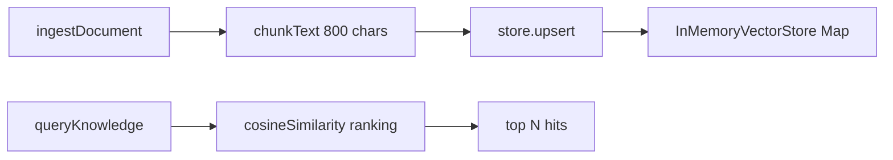
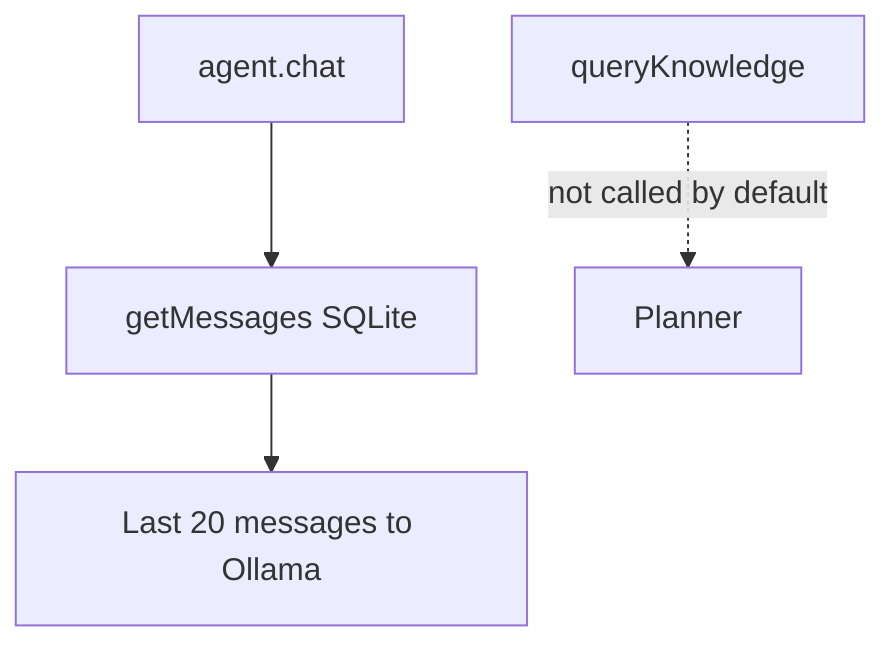

# Memory and RAG

**See also:** [docs index](../README.md) · [06 Data models](06-data-models.md) · [02 Request lifecycle](02-request-lifecycle.md)

JarvisOS splits **durable conversational state** (SQLite via `MemoryStore`) from **ephemeral knowledge retrieval** (in-memory vector stub under `memory/rag/`). They are related conceptually but not wired into the default chat planner today.

## Two memory layers

## SQLite memory (`@jarvisos/memory`)

### Package exports

- `.` → `MemoryStore`, types (`memory/src/store.ts`, `memory/src/types.ts`)
- `./rag` → ingest/query helpers (`memory/rag/index.ts`)

### Initialization

`MemoryStore` constructor (`memory/src/store.ts`):

1. Opens `better-sqlite3` at `DATABASE_PATH` (default `database/jarvisos.db`)
2. `PRAGMA journal_mode = WAL`, `foreign_keys = ON`
3. Executes `database/schema.sql` (resolved via multiple candidate paths from dist/cwd)
4. Runs `migrateLegacySchema()` for older DBs (metadata column rename, `tasks`, `memory_entries`)

Backend creates parent dirs in `backend/src/index.ts` before listen.

### Operations used by the agent

| Method | Used when |
|--------|-----------|
| `createConversation` / `getMessages` | Every `chat()` — history cap 20 |
| `addMessage` | User + assistant turns |
| `createTask` / `updateTask` | Actionable chat with plan execution |

### HTTP API (`backend/src/routes/memory.ts`)

| Method | Path | Behavior |
|--------|------|----------|
| GET | `/api/memory/conversations` | List conversations |
| GET | `/api/memory/conversations/:id` | Conversation + messages |
| GET | `/api/memory/tasks` | List agent tasks |
| GET/POST/DELETE | `/api/memory/kv` | Key-value `memory_entries` |

KV memory is **not** automatically injected into planner context in MVP—available for apps/settings to store preferences.

### Schema tables (memory-related)

Defined in `database/schema.sql` and used by `MemoryStore`:

- `conversations`, `messages`, `tasks`, `memory_entries`

Additional tables in the same file (`memory_facts`, `documents`, `tool_runs`, `transcriptions`) are **schema placeholders** for research/audit—not yet driven by `MemoryStore` methods. See [06 Data models](06-data-models.md).

## RAG pipeline (`memory/rag/`)

### Embeddings (`memory/rag/embeddings.ts`)

- **64-dimensional** deterministic vectors from SHA-256 token hashing
- `embedText(text)` — no external model; suitable for offline stub
- `cosineSimilarity(a, b)` — ranking metric

**Tradeoff:** Fast and zero dependencies vs. no semantic understanding (lexical-ish behavior only).

### Vector store (`memory/rag/vector-store.ts`)

- `InMemoryVectorStore` — `backend: "memory"`, process-local `Map`
- `createVectorStore()` — if `JARVIS_VECTOR_BACKEND=lancedb`, logs warning and **still** uses in-memory (LanceDB not implemented)

**Implication:** Ingested knowledge is **lost on API restart**.

### Knowledge base (`memory/rag/knowledge-base.ts`)

| Function | Behavior |
|----------|----------|
| `ingestDocument({ text, source?, title?, tags? })` | Chunks text, upserts each chunk with metadata |
| `queryKnowledge(query, limit?)` | Embed query, rank, return hits |
| `getKnowledgeStats()` | Document count + backend name |
| `resetKnowledgeStore()` | Clears singleton (tests) |

Chunking: max ~800 chars, prefers breaking on `\n\n` (`CHUNK_SIZE` constant).

### HTTP API (`backend/src/routes/knowledge.ts`)

| Method | Path | Body |
|--------|------|------|
| POST | `/api/knowledge/ingest` | `{ text, source?, title?, tags? }` |
| POST | `/api/knowledge/query` | `{ query, limit? }` |

Agent routes (`backend/src/routes/agent.ts`) can also call `ingestDocument` / `queryKnowledge` for capability flows—check that file for embedded knowledge helpers.

## Chat history vs. RAG

To use RAG in answers today, a future step would inject `queryKnowledge` hits into `PlannerOptions.context` or `chat.system.md`—not present in `agent/src/orchestrator.ts` MVP.

## Documents package (related, not RAG store)

`@jarvisos/documents` (`documents/src/`) handles PDF text extraction and Ollama summarization for `POST /api/research/summarize`. Indexed document metadata table exists in `schema.sql` (`documents`) but persistence wiring is separate from `memory/rag` in-memory store.

## Configuration

| Variable | Effect |
|----------|--------|
| `DATABASE_PATH` | SQLite file location (`backend/src/config.ts`) |
| `JARVIS_VECTOR_BACKEND` | `lancedb` requested → warning + in-memory fallback |

## Operational notes

- Run `npm rebuild better-sqlite3` if Node version changes (see `INTEGRATION.md`)
- Backup: copy `database/jarvisos.db` while API stopped
- For production RAG: implement LanceDB (or similar) in `createVectorStore()` and persist under `data/`

## Related files

| Path | Role |
|------|------|
| `memory/src/store.ts` | SQLite CRUD |
| `memory/rag/knowledge-base.ts` | Ingest/query API |
| `memory/rag/embeddings.ts` | Stub embeddings |
| `database/schema.sql` | Canonical DDL |
| `backend/src/routes/memory.ts` | REST for conversations/KV |
| `backend/src/routes/knowledge.ts` | REST for RAG |
