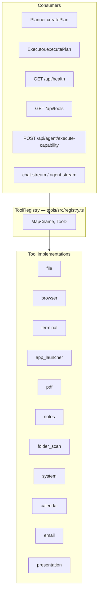
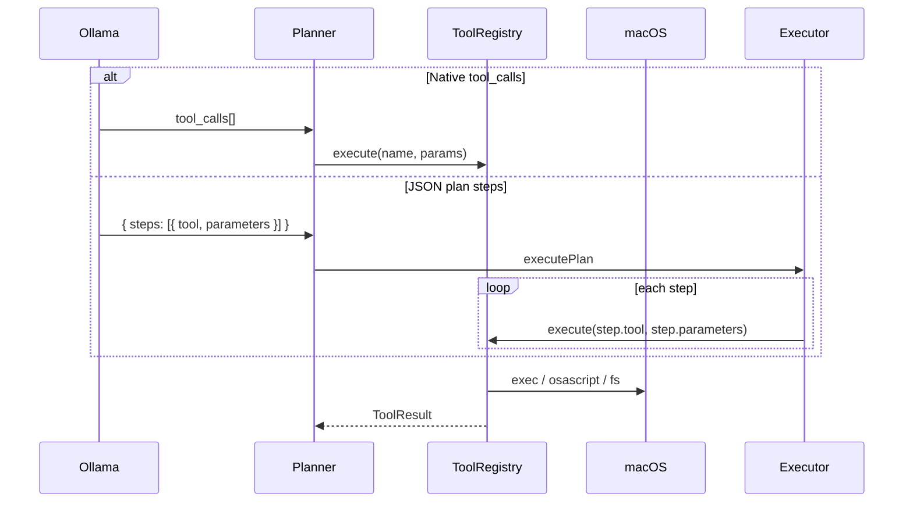

# Tools and plugins

**See also:** [docs index](../README.md) · [02 Request lifecycle](02-request-lifecycle.md) · [06 Data models](06-data-models.md)

macOS capabilities are exposed to the LLM as **named tools** with JSON Schema parameters. A single `ToolRegistry` instance is shared across planner, executor, backend routes, and health checks.

## Architecture



Export: `toolRegistry` singleton (`export const toolRegistry = new ToolRegistry()`).

## Tool contract

Defined in `tools/src/types.ts`:

```typescript
interface Tool {
  name: string;
  description: string;
  parameters: ToolParametersSchema;  // JSON Schema subset
  execute: (params: Record<string, unknown>) => Promise<ToolResult>;
}

interface ToolResult {
  success: boolean;
  data?: unknown;
  error?: string;
  message?: string;
  durationMs?: number;
}
```

## Registered tools (default)

From `defaultTools` in `tools/src/registry.ts`:

| Name | Module | Typical actions |
|------|--------|-----------------|
| `file` | `tools/src/tools/file-tool.ts` | read, write, list, search, move, … |
| `browser` | `browser-tool.ts` | open URL, search |
| `terminal` | `terminal-tool.ts` | run allowlisted shell commands |
| `app_launcher` | `app-launcher-tool.ts` | open macOS apps |
| `pdf` | `pdf-tool.ts` | extract / summarize PDFs |
| `notes` | `notes-tool.ts` | Notes.app integration |
| `folder_scan` | `folder-scan-tool.ts` | scan Desktop/Documents/Downloads |
| `system` | `system-tool.ts` | volume, brightness, etc. |
| `calendar` | `calendar-tool.ts` | Calendar.app events |
| `email` | `email-tool.ts` | Mail drafts |
| `presentation` | `presentation-tool.ts` | HTML decks under `~/JarvisOS/presentations/` |

Each tool with an `action` enum documents actions in `formatPlannerToolsList()` for the planner prompt.

## Invocation paths



### Registry methods

| Method | Purpose |
|--------|---------|
| `execute(name, params)` | Lookup + `tool.execute`; unknown tool → `{ success: false }` |
| `getOllamaTools()` | Ollama `function` definitions for `chatWithTools` |
| `formatPlannerToolsList()` | Text block for `{{TOOLS_LIST}}` in prompts |
| `getSchemas()` / `list()` | UI and `/api/tools` |

## Ollama tool schema normalization

`normalizeOllamaParameters()` sets `type: object`, copies property enums, sets `additionalProperties: false` (`tools/src/registry.ts`). Keeps planner-compatible JSON Schema for Gemma tool calling.

## Safety and boundaries

### Terminal (`tools/src/utils/safety.ts`)

- `BLOCKED_PATTERNS` — destructive `rm`, `mkfs`, fork bombs, etc.
- `DEFAULT_ALLOWLIST` — allowed command prefixes (`git`, `npm`, `open`, …)
- `validateTerminalCommand()` — used by `terminal-tool.ts`

### Paths (`tools/src/utils/paths.ts`)

Resolves user-home areas (Desktop, Documents, Downloads, JarvisOS folder) — tools should stay within expected macOS user scope.

### Result helpers (`tools/src/utils/result.ts`)

Consistent `ok()` / `fail()` shaping for tool implementations.

**Tradeoff:** Convenience for a personal assistant vs. **no cryptographic sandbox**—assume trusted operator.

## HTTP exposure

| Endpoint | File | Behavior |
|----------|------|----------|
| `GET /api/tools` | `backend/src/routes/tools.ts` | Lists schemas from registry |
| `GET /api/health` | `backend/src/routes/health.ts` | `tools.count`, `tools.names` |
| Direct execute | Agent/plan/SSE paths | Via `getContainer().tools` |

Capabilities catalog (`backend/src/data/capabilities-catalog.ts`) maps UI “skills” to `{ toolName, defaultParameters }` for one-shot execution without full planning.

## Testing and coverage

- Tests: `tools/src/**/*.test.ts` (Vitest, node environment)
- Config: `tools/vitest.config.ts` — v8 coverage, `json-summary` reporter
- Summary artifact: `tools/coverage/coverage-summary.json`

**Latest snapshot (representative):**

| Area | Line coverage (approx.) |
|------|-------------------------|
| **Total** | ~23% |
| `utils/safety.ts` | ~97% |
| `utils/result.ts` | ~88% |
| `app-launcher-tool.ts` | 100% |
| `terminal-tool.ts` | ~62% |
| `file-tool.ts` | ~53% |
| Most other tools | 0% (untested paths) |

Run: `npm run test:coverage -w @jarvisos/tools`.

**Implication:** Registry and several tools rely on manual/macOS integration testing; CI may not exercise AppleScript paths.

## “Plugins” model

There is **no dynamic plugin loader** in MVP:

- New tool = new file under `tools/src/tools/` + register in `defaultTools` array
- Rebuild `@jarvisos/tools` and restart backend

Future plugin design could:

1. Export a `Tool[]` from separate npm packages
2. Pass custom registry into `AgentOrchestrator` constructor (today hard-wired to `toolRegistry` in container)

## Planner prompt integration

`prompts/planner.system.md` instructs the model to emit JSON plans or use tools. `agent/src/prompts.ts` loads templates from `prompts/` with `{{TOOLS_LIST}}` substitution.

## Related files

| Path | Role |
|------|------|
| `tools/src/registry.ts` | Registry + singleton |
| `tools/src/types.ts` | Tool/result types |
| `agent/src/planner.ts` | Ollama tools + JSON parse |
| `agent/src/executor.ts` | Step loop |
| `backend/src/services/container.ts` | Wires `toolRegistry` |
| `tools/coverage/coverage-summary.json` | Coverage metrics |
