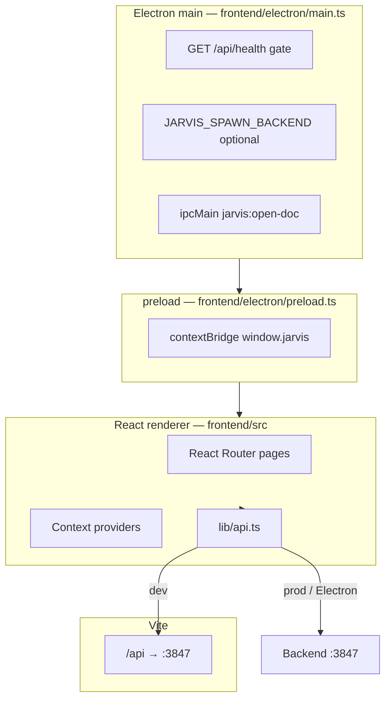
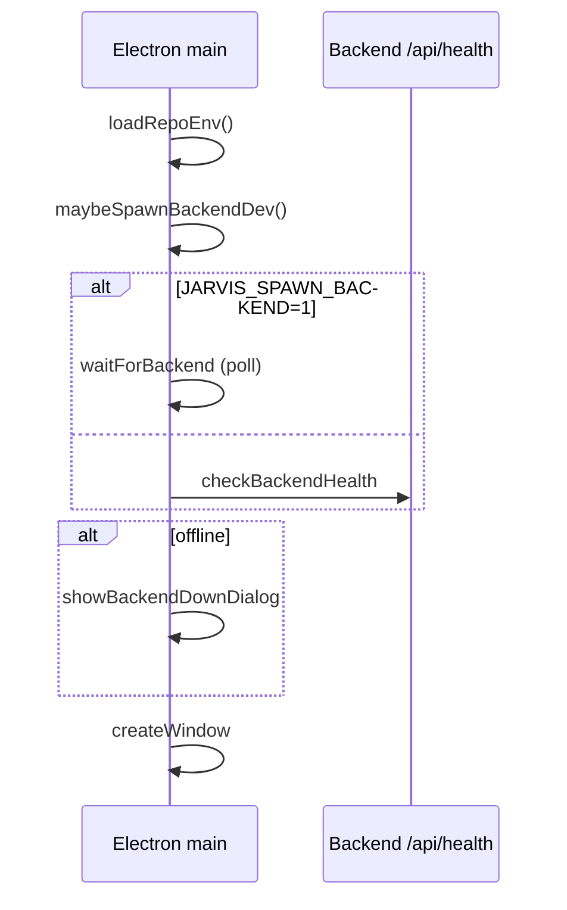

# Frontend and Electron

**See also:** [docs index](../README.md) · [02 Request lifecycle](02-request-lifecycle.md) · [01 High-level](01-high-level-architecture.md)

The desktop experience is a **Vite + React 18** SPA, optionally wrapped in **Electron**. All business logic stays on the backend; the UI is a thin HTTP client with local state and polling.

## Layer diagram



## Application structure

### Entry and routing

- `frontend/src/main.tsx` — React root
- `frontend/src/App.tsx` — providers + routes:

| Route | Page | Role |
|-------|------|------|
| `/` | `Dashboard.tsx` | Status, shortcuts |
| `/chat` | `Chat.tsx` | Conversation UI |
| `/agent` | `Agent.tsx` | Plan/execute, SSE task stream |
| `/voice` | `Voice.tsx` | Mic → transcribe → chat stream |
| `/files` | `Files.tsx` | Search/upload |
| `/tools` | `Tools.tsx` | Tool catalog from API |
| `/settings` | `Settings.tsx` | Preferences display |

Layout shell: `frontend/src/components/Layout.tsx`, `Sidebar.tsx`.

### Context providers

| Provider | File | Responsibility |
|----------|------|----------------|
| `ToastProvider` | `context/ToastContext.tsx` | Notifications |
| `BackendProvider` | `context/BackendContext.tsx` | Poll `GET /api/health` every 10s |
| `AppProvider` | `context/AppContext.tsx` | App-wide UI state |
| `PendingChatMessageProvider` | `context/PendingChatMessageContext.tsx` | Cross-page message handoff |

Hook: `useBackend()` exposes `online`, `ollama`, `health`.

### API client (`frontend/src/lib/api.ts`)

**Base URL resolution:**

1. **Vite dev** (`import.meta.env.DEV && import.meta.hot`): `""` — same-origin `/api` via proxy
2. **Electron**: `window.jarvis.apiBaseUrl` from preload
3. Else: `VITE_API_URL` or `http://127.0.0.1:3847`

`normalizeApiOrigin()` maps `localhost` → `127.0.0.1` to avoid CORS/IPv6 splits.

**Key methods:**

| Method | Backend | Notes |
|--------|---------|-------|
| `health()` | `GET /api/health` | Dashboard/status |
| `chat()` | `POST /api/chat` | JSON response |
| `streamChatFull()` | `POST /api/chat/stream` | SSE: tokens + plan steps |
| `streamAgentTask()` | `POST /api/agent/stream` | SSE: agent steps |
| `createPlan` / `executePlan` | `/api/plan`, `/api/execute` | Agent page pipeline |
| `getCapabilities()` | `GET /api/agent/capabilities` | With `fallbackCapabilities` |
| Voice/files/research | respective `/api/*` | See `INTEGRATION.md` |

Types: `frontend/src/types/index.ts`, `frontend/src/lib/backend-types.ts`, mappers in `plan-mapper.ts`.

### Vite config (`frontend/vite.config.ts`)

- Alias `@` → `frontend/src`
- `base: "./"` for Electron file protocol
- Dev server `127.0.0.1:5173`, strict port
- Proxy `/api` → `3847`, 300s timeout for slow Ollama

## Electron main process

File: `frontend/electron/main.ts`

### Startup sequence



- **Packaged builds** never auto-spawn backend
- **Dev spawn**: `npm run dev -w @jarvisos/backend` when `JARVIS_SPAWN_BACKEND=1`
- Window: hidden inset title bar, dark `#0a0c0f`, `contextIsolation: true`, `nodeIntegration: false`, `sandbox: true`

### Environment loading

`frontend/electron/load-env.ts`:

- `REPO_ROOT` = two levels above `frontend/electron/`
- Parses repo `.env` without overwriting existing `process.env`
- `resolveApiBase()` — `JARVIS_API_URL` → `VITE_API_URL` → `http://127.0.0.1:${PORT}`

Matches backend `config.ts` behavior for consistent health URLs.

## IPC surface

Minimal by design—no generic `ipcMain` RPC to Node APIs.

| Channel | Direction | Handler |
|---------|-----------|---------|
| `jarvis:open-doc` | renderer → main | `shell.openPath` under `REPO_ROOT` (basename only) |

Preload (`frontend/electron/preload.ts`) exposes:

```typescript
window.jarvis = {
  platform,
  apiBaseUrl,
  openDoc(filename),
  versions: { node, chrome, electron },
};
```

Typed in `frontend/src/vite-env.d.ts` as `JarvisElectronAPI`.

**Tradeoff:** Small attack surface vs. no native file-picker IPC (upload uses HTTP multipart instead).

## UI components (agent UX)

| Component | File | Role |
|-----------|------|------|
| `PlanStepsPanel` | `components/PlanStepsPanel.tsx` | Live step status |
| `ToolResultChips` | `components/ToolResultChips.tsx` | Per-tool outcomes |
| `CapabilityExamplesPanel` | `components/CapabilityExamplesPanel.tsx` | Suggested tasks |
| `FileDropZone` | `components/FileDropZone.tsx` | Upload UX |
| `OfflineBanner` | (if present in Layout) | API unreachable |

## Production build

```bash
npm run build -w @jarvisos/frontend   # Vite → frontend/dist
# electron-builder → frontend/release/*.dmg
```

`frontend/package.json` `build` config:

- `directories.output`: `release`
- macOS `dmg` target (arm64 in verified builds)
- `VITE_API_URL` should point to local API before `package`

Electron loads `dist/index.html` when `!app.isPackaged` is false.

## Dev workflows

| Command | Result |
|---------|--------|
| `npm run dev` (root) | Backend + Vite |
| `npm run electron:dev -w @jarvisos/frontend` | Electron + Vite URL |
| Browser only | `http://127.0.0.1:5173` |

## Security notes (renderer)

- No `nodeIntegration` in renderer
- External links: `setWindowOpenHandler` → `shell.openExternal`, deny new Electron windows
- API auth: none (localhost trust model)

## Related files

| Path | Role |
|------|------|
| `frontend/electron/main.ts` | Window + health gate |
| `frontend/electron/preload.ts` | IPC bridge |
| `frontend/src/lib/api.ts` | HTTP/SSE client |
| `frontend/src/context/BackendContext.tsx` | Health polling |
| `frontend/vite.config.ts` | Proxy + alias |
| `frontend/README.md` | Frontend-specific notes |
