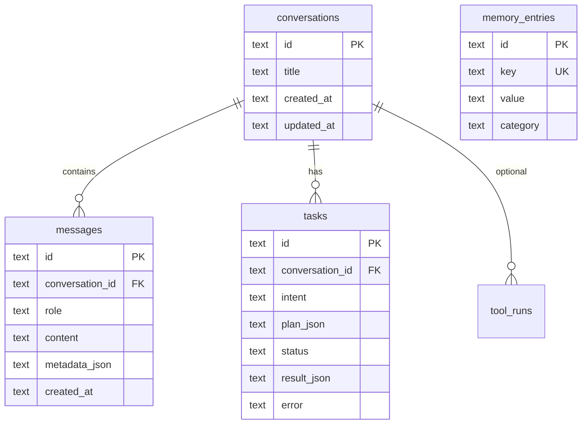

# Data models

**See also:** [docs index](../README.md) · [03 Memory & RAG](03-memory-and-rag.md) · [02 Request lifecycle](02-request-lifecycle.md)

Canonical types live in workspace packages; HTTP contracts in the backend; persistence in SQLite (`database/schema.sql` + `MemoryStore` migrations).

## Type system map

```mermaid
flowchart LR
  subgraph agent_pkg [@jarvisos/agent]
    Plan[Plan / PlanStep]
    Exec[ExecutionResult]
    Chat[ChatResult / ChatOptions]
  end

  subgraph memory_pkg [@jarvisos/memory]
    Conv[Conversation]
    Msg[Message]
    Task[Task]
    KV[MemoryEntry]
  end

  subgraph tools_pkg [@jarvisos/tools]
    Tool[Tool / ToolResult]
  end

  subgraph backend_api [backend/src/types/api.ts]
    ChatReq[ChatRequestBody]
    ChatRes[ChatResponseBody]
    Health[HealthResponseBody]
  end

  subgraph frontend [frontend/src]
    UIMsg[ChatMessage UI types]
    AgentPlan[AgentPlan]
  end

  backend_api --> agent_pkg
  frontend --> backend_api
  agent_pkg --> tools_pkg
  agent_pkg --> memory_pkg
```

## Agent domain (`agent/src/types.ts`)

### Plan

```typescript
interface PlanStep {
  id: string;
  description: string;
  tool: string;
  parameters: Record<string, unknown>;
}

interface Plan {
  intent: string;
  steps: PlanStep[];
  response?: string;  // optional direct reply from planner
}
```

### Execution

```typescript
interface StepExecutionResult {
  stepId: string;
  tool: string;
  success: boolean;
  data?: unknown;
  error?: string;
  durationMs: number;
}

interface ExecutionResult {
  plan: Plan;
  steps: StepExecutionResult[];
  summary: string;
}
```

### Chat

```typescript
interface ChatOptions {
  conversationId?: string;
  contextMessages?: ChatMessage[];
  executePlan?: boolean;  // default true in orchestrator
}

interface ChatResult {
  conversationId: string;
  response: string;
  plan?: Plan;
  execution?: ExecutionResult;
}
```

### Ollama

- `OllamaConfig` — `baseUrl`, `model`, `numGpu`, `flashAttn`, `numCtx`
- `PlannerResult` — `plan` + optional `ollamaToolResults`
- `OllamaToolCall` — native function call shape from Ollama API

## Memory domain (`memory/src/types.ts`)

| Type | Fields (high level) |
|------|---------------------|
| `Conversation` | `id`, `title`, `createdAt`, `updatedAt` |
| `Message` | `id`, `conversationId`, `role`, `content`, `metadata`, `createdAt` |
| `Task` | `id`, `conversationId?`, `intent`, `planJson`, `status`, `resultJson`, `error`, timestamps |
| `MemoryEntry` | `id`, `key`, `value`, `category`, timestamps |

`MessageRole`: `user` | `assistant` | `system` | `tool`

`TaskStatus`: `pending` | `running` | `completed` | `failed` | `cancelled`

**Message metadata:** Assistant messages from actionable chat may store `{ plan, execution }` (JSON in `metadata_json` column).

## Tools domain (`tools/src/types.ts`)

- `ToolParametersSchema` — JSON Schema subset (`properties`, `required`, enums)
- `Tool` — `name`, `description`, `parameters`, `execute()`
- `ToolResult` — `success`, `data`, `error`, `durationMs`

## RAG domain (`memory/rag/`)

| Type | Location | Purpose |
|------|----------|---------|
| `VectorDocument` | `vector-store.ts` | `id`, `text`, `metadata`, `embedding`, `createdAt` |
| `VectorSearchHit` | `vector-store.ts` | `id`, `text`, `score`, `metadata` |
| `IngestInput` / `QueryResult` | `knowledge-base.ts` | API payloads |

Not persisted to SQLite in MVP.

## HTTP API contracts (`backend/src/types/api.ts`)

### Chat

```typescript
interface ChatRequestBody {
  message: string;
  conversationId?: string;
  executePlan?: boolean;
}

interface ChatResponseBody {
  conversationId: string;
  response: string;
  plan?: Plan;
  execution?: ExecutionResult;
  reply?: { id; role: "assistant"; content; timestamp };  // UI compat
}
```

### Plan / execute

- `PlanRequestBody`: `{ intent, context? }`
- `ExecuteRequestBody`: `{ plan: Plan }`
- `AgentRunRequestBody`: `{ task, execute? }`

### Health

```typescript
interface HealthResponseBody {
  status: "ok" | "degraded";
  version: string;
  ollama: { reachable, model, modelAvailable, error? };
  tools: { count, names: string[] };
}
```

### Capabilities

- `ExecuteCapabilityRequestBody`: `{ capabilityId, parameters? }`
- Catalog types in `backend/src/data/capabilities-catalog.ts` (IDs, labels, tool mapping)

## Frontend view models

`frontend/src/types/index.ts` — UI-facing `ChatMessage`, `AgentPlan`, `ToolResult`, `HealthResponse`, etc.

Mapping layer:

- `frontend/src/lib/plan-mapper.ts` — `BackendPlan` → `AgentPlan` with step status
- `frontend/src/lib/backend-types.ts` — mirrors backend JSON shapes
- `frontend/src/data/fallbackCapabilities.ts` — offline capability list

## SQLite schema (`database/schema.sql`)

### Actively used by `MemoryStore`

| Table | Purpose |
|-------|---------|
| `conversations` | Chat sessions |
| `messages` | Turn history; `metadata_json` for plan/execution |
| `tasks` | Planner runs linked to conversations |
| `memory_entries` | KV store (`/api/memory/kv`) |

### Defined for future / other subsystems

| Table | Intended use |
|-------|----------------|
| `memory_facts` | Long-term facts with `source` (not in MemoryStore CRUD yet) |
| `documents` | Indexed PDF paths + summaries for research |
| `tool_runs` | Audit log of tool invocations |
| `transcriptions` | Voice dedupe cache |

**Note:** `MemoryStore.migrateLegacySchema()` can create `tasks` / `memory_entries` if missing; full `schema.sql` is still executed on fresh DBs.

### ER diagram (core chat path)



## SSE event payloads (informal schema)

### `POST /api/chat/stream`

| Event | Data shape |
|-------|------------|
| `token` | `{ text: string }` |
| `plan` | `{ intent, steps: [{ id, order, description, tool, status }] }` |
| `step_start` | `{ stepId, tool, description, startedAt }` |
| `step_done` | `{ stepId, tool, success, data?, error?, durationMs }` |
| `error` | `{ message }` |
| `done` | `{ conversationId? }` |

### `POST /api/agent/stream`

| Event | Data shape |
|-------|------------|
| `plan` | `{ intent, response?, steps: [...] }` |
| `step_start` / `step_done` | Same idea as chat stream |
| `summary` | `{ text }` |
| `done` | `{}` |

## Configuration model (`backend/src/config.ts`)

`appConfig` object (not a DB table):

| Key | Env | Default |
|-----|-----|---------|
| `port` | `PORT` | `3847` |
| `ollama.baseUrl` | `OLLAMA_BASE_URL` | `http://127.0.0.1:11434` |
| `ollama.model` | `OLLAMA_MODEL` | `gemma4:e4b` |
| `databasePath` | `DATABASE_PATH` | `{repo}/database/jarvisos.db` |
| `uploadsDir` | `UPLOADS_DIR` | `{repo}/data/uploads` |
| `corsOrigins` | `CORS_ORIGINS` | localhost Vite ports |

## ID and time conventions

- IDs: `randomUUID()` (Node `crypto`) for conversations, messages, tasks, memory entries, RAG chunks
- Timestamps: ISO 8601 strings in SQLite (`datetime('now')` defaults in schema)

## Related files

| Path | Content |
|------|---------|
| `agent/src/types.ts` | Plan/execution/chat types |
| `memory/src/types.ts` | Persistence entities |
| `tools/src/types.ts` | Tool contracts |
| `backend/src/types/api.ts` | REST DTOs |
| `database/schema.sql` | DDL |
| `memory/src/store.ts` | Row mapping (`mapMessage`, etc.) |
