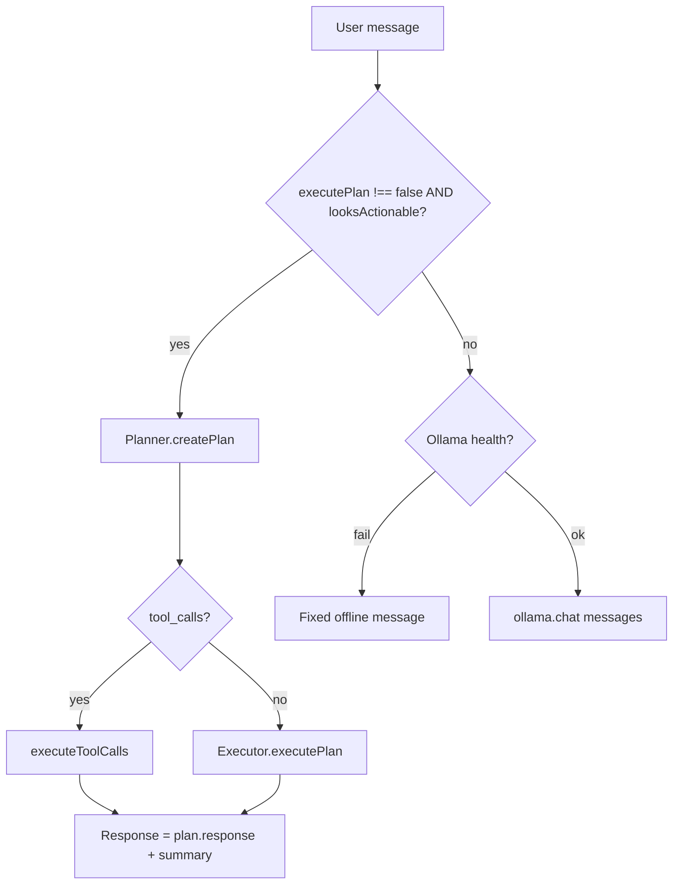

# Prompts and agent behavior

JarvisOS behavior is shaped by **markdown system prompts** under `prompts/` and by routing logic in `agent/src/orchestrator.ts`. All LLM calls go to **Ollama**; prompts are not sent to Google Gemini.

## Prompt files

Loaded by `agent/src/prompts.ts` (cached read of `prompts/<name>.system.md`):

| File | Role | Template variables |
|------|------|-------------------|
| `prompts/chat.system.md` | Conversational Jarvis persona | `{{TOOLS_LIST}}` |
| `prompts/planner.system.md` | JSON plan + tool catalog | `{{TOOLS_LIST}}`, `{{CONTEXT}}`, `{{USER_INTENT}}` |
| `prompts/executor.system.md` | Post-step user-facing summary | `{{STEP_DESCRIPTION}}`, `{{TOOL_NAME}}`, `{{TOOL_RESULT}}`, `{{ERROR}}` |

`renderTemplate()` performs simple `{{KEY}}` replacement (`agent/src/prompts.ts`).

### Chat system prompt (summary)

`prompts/chat.system.md` defines:

- Offline Jarvis persona (Gemma via Ollama).
- No direct tool calls in pure chat mode—actions go through planner/executor when the orchestrator chooses the actionable path.
- Safety rules (no bypassing macOS security, no fabricated tool output).

### Planner system prompt (summary)

`prompts/planner.system.md` defines:

- **JSON-only** plan schema (`intent`, `steps[]`, optional `response`).
- Tool names must match the 11 registry tools (`browser`, `file`, `app_launcher`, …).
- References capability catalog IDs (58+ examples at `GET /api/agent/capabilities`).
- Encourages native Ollama `tool_calls` when supported.

### Executor system prompt (summary)

`prompts/executor.system.md` defines:

- 1–3 sentence plain-text summary after tool runs.
- Must not invent paths or outcomes beyond `TOOL_RESULT` / `ERROR`.

### Ad-hoc prompts (not in `prompts/`)

| Location | Purpose |
|----------|---------|
| `documents/src/summarize.ts` | Inline “research assistant” JSON instruction over PDF corpus |
| `backend/src/routes/chat-stream.ts` | Post-execution: *“Summarize what was done in 1-2 sentences.”* appended as a user message |

## Context construction

### Conversation memory

1. User message stored: `memory.addMessage({ role: "user", … })`.
2. History loaded: `memory.getMessages(conversationId, 20)`.
3. Roles kept for Ollama: `user`, `assistant`, `system` only.

### Planner context

`orchestrator.buildContext()` — last **6** history lines formatted as `role: content` (`agent/src/orchestrator.ts`), passed as `{{CONTEXT}}` in the planner template.

### Chat messages array

For non-actionable chat:

```text
[ system: chat.system.md + TOOLS_LIST, ...history ]
```

For planning:

```text
[ system: planner.system.md + vars, user: intent ]
```

Optional `tools` array attached for Ollama native calling.

## Routing: chat vs plan/execute

`AgentOrchestrator.chat()` (`agent/src/orchestrator.ts`):



**`looksActionable()`** — regex heuristics:

- **Skips** planning for clear informational questions (`what is`, `who are`, `explain`, …).
- **Triggers** planning when action verbs appear (`open`, `search`, `summarize`, `run`, …).

Same logic duplicated in `backend/src/routes/chat-stream.ts` for SSE parity.

## Planner outcomes

`Planner.createPlan()` (`agent/src/planner.ts`):

1. Calls `ollama.chatWithTools` with `temperature: 0.2`, `format: "json"`, and registry `tools`.
2. **If `tool_calls` present:** map to plan steps and run immediately via `executeToolCalls`.
3. **Else:** `parsePlanJson(result.content)`:
   - Strips markdown fences if present.
   - Empty `steps` → fallback single `system` / `get_volume` step.
   - Parse error → fallback plan + user-visible message in `response`.

## Executor behavior

`Executor.executePlan()`:

1. Sequential `tools.execute` per step (no parallel steps).
2. `summarize()` builds executor prompt from all step results.
3. Uses `ollama.generate()` (completion API), not chat, for the summary.

## Streaming path differences

`POST /api/chat/stream`:

- Does not inject `chat.system.md` on the pure-chat branch—it streams raw `messages` from history only.
- Actionable path: `agent.plan()` then tool execution, then `streamTokens()` with a summary user turn.

When aligning behavior, compare with non-streaming `orchestrator.chat()` which always adds the chat system prompt for Q&A.

## Tool list injection

`formatToolsList()` → `ToolRegistry.formatPlannerToolsList()` (`@jarvisos/tools`). Exposed to the model so it knows names, actions, and parameters for planning—mirrors the catalog in `backend/src/data/capabilities-catalog.ts` (API) and `frontend/src/data/fallbackCapabilities.ts` (offline UI).

## Tasks and metadata

Actionable chat creates a `Task` row (`memory.createTask`) with `planJson`, updates status `running` → `completed` / `failed`. Assistant messages may include `metadata: { plan, execution }` for the UI.
