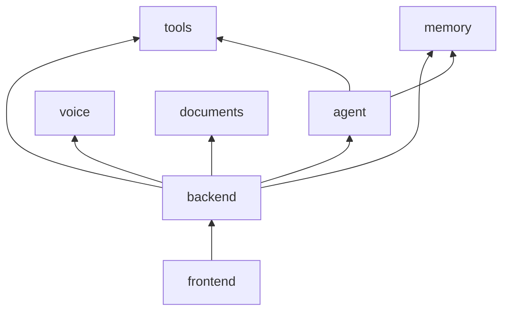

# JarvisOS module reference

Package-level reference for the **jarvisos** npm workspaces monorepo. For end-to-end architecture and API wiring, see [INTEGRATION.md](../../INTEGRATION.md) and [README.md](../../README.md).

## Workspaces (npm)

Root `package.json` defines seven workspaces:

| Workspace | NPM package | Doc |
|-----------|-------------|-----|
| `frontend/` | `@jarvisos/frontend` | [frontend.md](./frontend.md) |
| `backend/` | `@jarvisos/backend` | [backend.md](./backend.md) |
| `agent/` | `@jarvisos/agent` | [agent.md](./agent.md) |
| `tools/` | `@jarvisos/tools` | [tools.md](./tools.md) |
| `memory/` | `@jarvisos/memory` | [memory.md](./memory.md) |
| `voice/` | `@jarvisos/voice` | [voice.md](./voice.md) |
| `documents/` | `@jarvisos/documents` | [documents.md](./documents.md) |

## Supporting directories (not workspaces)

| Path | Doc |
|------|-----|
| `prompts/` | [prompts.md](./prompts.md) |
| `database/` | [database.md](./database.md) |
| `models/` | [models.md](./models.md) |
| `scripts/` | Covered in [models.md](./models.md#scripts) and [development/01-contributing.md](../development/01-contributing.md) |

## Dependency graph



**Build order (TypeScript):** `tools` → `memory` → `agent` → `backend`. Optional: `voice`, `documents`. Frontend builds independently but expects a running API.

```bash
npm run build:core   # tools, memory, agent, backend
npm run build        # all workspaces with a build script
```

## Runtime data (not packages)

| Path | Purpose |
|------|---------|
| `database/jarvisos.db` | SQLite file (created on first backend start) |
| `data/uploads/` | Uploaded files (`UPLOADS_DIR`) |
| `~/JarvisOS/` | Tool outputs (notes, calendar, email drafts, presentations) |

## Related documentation

| Topic | Location |
|-------|----------|
| Quick start | [QUICKSTART.md](../../QUICKSTART.md) |
| Integration & ports | [INTEGRATION.md](../../INTEGRATION.md) |
| Product requirements | [prd.md](../../prd.md) |
| Contributing (repo root) | [CONTRIBUTING.md](../../CONTRIBUTING.md) |
| Development guides | [../development/](../development/) |
| Ollama models | [models/README.md](../../models/README.md) |
| Architecture | [../architecture/](../architecture/) — start with [01-high-level-architecture.md](../architecture/01-high-level-architecture.md) |
| Gemini / Ollama behavior | [../gemini/](../gemini/) — start with [01-overview.md](../gemini/01-overview.md) |
| Doc hub | [../README.md](../README.md) |
